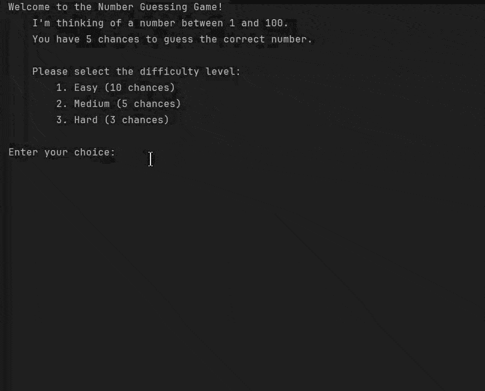

# 🎯 Number Guessing Game


---

Welcome to the **Number Guessing Game** – a fun, interactive, and addictive Python console game!  
Test your intuition, sharpen your logic, and see if you can beat the computer. 🕹️  

!

---

## 🕹️ Game Overview

The computer selects a random number between **1 and 100**, and your goal is to guess it correctly within a limited number of attempts.  

### 🎯 Difficulty Levels

| Difficulty | Attempts |
|-----------|----------|
| Easy      | 10       |
| Medium    | 5        |
| Hard      | 3        |

After each guess, the game will guide you:

- **Too high** → Number is smaller  
- **Too low** → Number is larger  

---

## 🚀 Features

- 🌟 Multiple difficulty levels  
- 🔄 Replayable rounds  
- 🎯 Hints after every guess  
- 🧠 Builds logical thinking and intuition  
- 💻 Beginner-friendly Python project  

---

## 🛠️ How to Play

1. Run the Python script:  

```bash
python number_guessing_game.py
````

2. Select your **difficulty level**:

   * 1 → Easy (10 chances)
   * 2 → Medium (5 chances)
   * 3 → Hard (3 chances)

3. Guess a number between **1 and 100**.

4. Follow hints until you find the correct number or run out of attempts.

5. Decide if you want to **play again** after each round.

---

## 💡 Example Gameplay


Welcome to the Number Guessing Game!
I'm thinking of a number between 1 and 100.
You have 5 chances to guess the correct number.

Please select the difficulty level:
    1. Easy (10 chances)
    2. Medium (5 chances)
    3. Hard (3 chances)

Enter your choice: 2
Great! You have selected the Medium difficulty Level
Let's start the game!

Enter your guess: 50
Incorrect! The number is greater than 50.
Enter your guess: 75
Incorrect! The number is less than 75.

Congratulations! You guessed the correct number in 3 attempts.
Do you want to play again? (y) or (n): n


## ⚡ Tech Stack

* **Language**: Python 3
* **Libraries**: `random` (standard library)


## 🎨 Why This Game Stands Out

* Simple and **easy-to-read code**, perfect for beginners
* Interactive gameplay with **difficulty scaling**
* Encourages **decision-making under pressure**
* Fun, replayable, and addictive!

---

## 📂 Project Structure

```
Number-Guessing-Game/
│
├── number_guessing_game.py  # Main Python script
└── README.md               # Project documentation
```

---

## ⭐ Contribution

Contributions are welcome! You can:

* Add new difficulty levels
* Improve UI with colors using `colorama`
* Add a **leaderboard** to track high scores
* Make a **GUI version** with `tkinter` or `pygame`

---

## 📜 License

This project is open-source and available under the **MIT License**.

---

> Made with ❤️ and Python by **Mehedi Hossen Fahim**


[# Number-Guessing-Game](https://roadmap.sh/projects/number-guessing-game)
